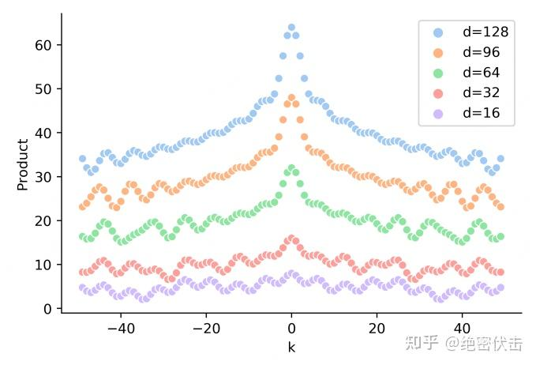

## 名词解释
大模型外推性：大模型在训练时和预测时的输入长度不一致，会导致模型的泛化能力下降。例如，如果一个模型在训练时只使用了512个 token 的文本，那么在预测时如果输入超过512个 token，模型可能无法正确处理。这就限制了大模型在处理长文本或多轮对话等任务时的效果。

## 来源参考：
- [十分钟读懂旋转编码（RoPE）](https://zhuanlan.zhihu.com/p/647109286)
- [再论大模型位置编码及其外推性（万字长文）](https://zhuanlan.zhihu.com/p/675243992)
- [Roformer: Enhanced Transformer With Rotray Position Embedding](https://link.zhihu.com/?target=https%3A//arxiv.org/pdf/2104.09864.pdf)

## 旋转编码介绍

### 基本概念

以 $w_i$ 表示输入序列中第 $i$ 个token, 定义一个长度为 $N$ 的输入序列为:  

$$ S_N=\lbrace  w_i\rbrace_{i=1}^N $$  

以 $x_i$ 表示第 $i$ 个token $w_i$ 对应的 $d$ 维词嵌入向量，输入序列 $S_N$ 对应的 embedding 表示为: 

$$ E_N = \lbrace x_i\rbrace_{i=1}^N $$

在做 self-attention 之前，会用词嵌入向量计算 $q, k, v$ 向量,同时加入位置信息，函数公式表达如下：

$$ q_m = f_q(x_m, m) $$

$$ k_n = f_k(x_n, n) $$

$$ v_n = f_v(v_n, n) $$

其中 $q_m$ 表示第m个token对应的词向量 $x_m$ 集成位置信息m之后的query向量。而 $k_n$ 和 $v_n$ 则表示第n个token对应的词向量 $x_n$ 集成位置信息n之后的key和value向量。  

基于transformer的位置编码方法着重于构造一个合适的 $f(q, k, v)$ 函数形式。

而计算第m个词嵌入向量 $x_m$ 对应的self-attention输出结果，即为 $q_m$ 和其他 $k_n$ 都计算一个attention score， 然后再将 attention score 乘以对应的 $v_n$ 再求和得到输出向量 $O_m$ :

$$ a_{m, n} = \frac{exp(\frac{q_m^T * k_n}{\sqrt{d}})} {\sum_{j=1}^N exp(\frac{q_m^T * k_j}{\sqrt{d}})}$$

$$ O_m = \sum_{n=1}^N a_{m,n}v_n $$

### 好的位置编码应具备的特点

- 每个位置输出一个唯一的编码
- 具备良好的外推性
- 任何位置之间的相对距离在不同长度的句子中应该是一致的

### 绝对位置编码

对于位置编码，常规的做法是在计算 query, key 和 value 向量之前，会计算一个位置编码向量 $p_i$ 加到词嵌入向量 $x_i$ 上，位置编码 $p_i$ 同样也是d维向量，然后再乘以对应的变换矩阵 $W$: 

$$ f_{t:t\in{\{q, k, v\}}}(x_i, i):=W_{t:t\in{\{q, k, v\}}}(x_i + p_i) $$

#### 基于训练的位置编码

通过可学习的Positional Embedding来编码位置信息，这种方案直接对不同的位置随机初始化一个postion embedding，然后与word embedding相加后输入模型。postion embedding作为模型参数的一部分，在训练过程中进行更新。比如下面是绝对位置编码的实现：

```python
# 初始化
self.position_embeddings = nn.Embedding(config.max_position_embeddings, config.hidden_size)

# 计算
position_embeddings = self.position_embeddings(position_ids)
embeddings += position_embeddings
```

- 每个位置都会被区分开，并且相邻的位置比较接近。
- 不具备外推性质，长度需要预设定，且不能更改。

#### 正弦编码

基于Sinusoidal的位置编码最初是由谷歌在论文Attention is All You Need中提出的方案，用于Transformer的位置编码。具体计算方式如下所示：

$$ PE_{pos, 2i} = sin(pos/10000^{2i/d}) $$

$$ PE_{pos, 2i+1} = cos(pos/10000^{2i/d}) $$

其中 $PE_{pos, 2i}$ 表示d维度向量 $PE_i$ 中的第 $2i$ 位置分量即偶数索引位置的计算公式，而 $PE_{pos, 2i+1}$ 对应第 $2i+1$ 位置分量即奇数索引位置的计算公式。

看起来是通过sin和cos函数将位置编码的取值固定在了[-1, 1]之前，但是为什么不用线性函数？而且这里面的10000是怎么想到的？
- 具有相对位置表达能力：Sinusoidal可以学习到相对位置，对于固定位置距离的k, `PE(i+k)` 可以表示成 `PE(i)` 的线性函数。
- 两个位置向量的内积只和相对位置 k 有关。
- Sinusoidal编码具有对称性。
- 随着k的增加，内积的结果会直接减少，即会存在远程衰减。

##### 相对位置表达能力

Sinusoidal可以学习到相对位置，对于固定位置距离的k，PE(i+k)可以表示成PE(i)的线性函数。证明如下：

$$ PE(t, 2i) = \sin(t*w_{2i}) $$

$$ PE(t, 2i+1) = \cos(t*w_{2i}) $$

$$ w_{2i} = 1/10000^{2i/d} $$

$$
PE(t + k, 2i) = \sin(t * w_{2i}+k * w_{2i}) = \sin(t * w_{2i})\cos(k * w_{2i})+\cos(t * w_{2i})\sin(k * w_{2i}) \\
= PE(t, 2i)PE(k, 2i + 1)+PE(t, 2i + 1)PE(k, 2i) = PE(t, 2i)u+PE(t, 2i + 1)v
$$

$$
PE(t + k, 2i + 1) = \cos(t * w_{2i}+k * w_{2i}) = \cos(t * w_{2i})\cos(k * w_{2i})-\sin(t * w_{2i})\sin(k * w_{2i}) \\
= PE(t, 2i + 1)PE(k, 2i + 1)-PE(t, 2i)PE(k, 2i) = PE(t, 2i + 1)u-PE(t, 2i)v
$$

其中u, v为关于k的常数，所以可以证明 `PE(i+k)` 可以由 `PE(i)` 线性表示。

##### 内积只和相对位置k有关

Attention中的重要操作就是内积。计算两个位置的内积 `PE(t+k)PE(t)` 如下所示：

$$
PE(t)PE(t + k) = \sum_{i = 0}^{d/2 - 1}PE(t, 2i)PE(t + k, 2i)+\sum_{i = 0}^{d/2 - 1}PE(t, 2i + 1)PE(t + k, 2i + 1) \\
= \sum_{i = 0}^{d/2 - 1}\sin(t * w_{2i})\sin[(t + k) * w_{2i}]+\sum_{i = 0}^{d/2 - 1}\cos(t * w_{2i})\cos[(t + k) * w_{2i}] \\
= \sum_{i = 0}^{d/2 - 1}\cos(k * w_{2i})
$$

可以看到，最终的结果是关于k的一个常数。这表明两个位置向量的内积只和相对位置k有关。

同时，可能推导出 $PE(t+k)PE(t) = PE(t)PE(t-k)$ ，这表明Sinusoidal编码具有对称性。

##### 远程衰减

可以发现，随着k的增加，位置向量的内积结果会逐渐降低，即会存在远程衰减。 如下图所示：


##### base=10000的参数选择

选择sin，cos是因为可以表达相对位置，以及具备远程衰减。但是sin/cos里面的参数10000是如何来的？

这里可以从sin/cos的周期性角度进行分析。分析周期可以发现，维度i的周期为 $T = base^{i/d} * 2 \pi$ , 其中 $0 <= i < d$ , 因此周期T的范围是 $T \in [2\pi, base *2\pi]$.

随着base的变大，周期会明显变长。Transformer选择比较大的base=10000，可能是为了能更好的区分开每个位置。

##### 正弦编码是否真的具备外推性？

实际的Attention计算中还需要与attention的权重W相乘，即 $PE_t^T W_q^T W_k PE_{t+k}$ , 这时候内积的结果就不能反映相对距离，如下图所示：  


### 2维旋转位置编码
为了能利用上token之间的相对位置信息，假定query向量 $q_m$ 和key向量 $k_n$ 之间的内积操作可以被函数 $g$ 表示，该函数 $g$ 的输入时词嵌入向量 $x_m$ , $x_n$和它们之间的相对位置 $m-n$ :

$$<f_q(x_m, m),f_k(x_n, n)> = g(x_m, x_n, m-n)$$

则对应目标是找到一个等价的位置编码方式，使得上式成立。
假定词嵌入向量的维度 $d=2$ , 利用2维平面上的向量几何性质，RoPE论文中提到了一个满足上述关系的 $f$ 和 $g$ 的形式如下：

$$ f_q(x_m, m)=(W_qx_m)e^{im\theta}$$

$$ f_k(x_n, n)=(W_kx_n)e^{in\theta}$$

$$ g_{(x_m, x_n,m-n)}=Re[(W_qx_m)(W_kx_n) * e^{i(m-n)\theta}] $$

其中 $Re$ 表示复数实部。

进一步地, $f_q$ 可以表示如下:

$$f_q(x_m, m) = 
\begin{pmatrix}
\cos m\theta & -\sin m\theta \\
\sin m\theta & \cos m\theta
\end{pmatrix}
\begin{pmatrix}
W_q^{(1,1)} & W_q^{(1,2)} \\
W_q^{(2,1)} & W_q^{(2,2)}
\end{pmatrix}
\begin{pmatrix}
x_m^{(1)} \\
x_m^{(2)}
\end{pmatrix} = 
\begin{pmatrix}
\cos m\theta & -\sin m\theta \\
\sin m\theta & \cos m\theta
\end{pmatrix}
\begin{pmatrix}
q_m^{(1)} \\
q_m^{(2)}
\end{pmatrix}$$

同理, $f_k$ 可以表示如下：

$$ f_k(x_m, m) =
\begin{pmatrix}
cos m\theta & -sin m\theta \\
sin m\theta & cos m\theta
\end{pmatrix}
\begin{pmatrix}
W_k^{(1,1)} & W_k^{(1,2)} \\
W_k^{(2,1)} & W_k^{(2,2)}
\end{pmatrix}
\begin{pmatrix}
x_m^{(1)} \\
x_m^{(2)} \\
\end{pmatrix} =
\begin{pmatrix}
cos m\theta & -sin m\theta \\
sin m\theta & cos m\theta
\end{pmatrix}
\begin{pmatrix}
k_m^{(1)} \\
k_m^{(2)}
\end{pmatrix}
$$

而 $g(x_m, x_n, m-n)$ 可以表示如下：

$$ g(x_m, x_n, m-n) = (q_m^{(1)} \quad q_m^{(2)})
\begin{pmatrix}
cos (m-n)\theta & -sin (m-n)\theta \\
sin (m-n)\theta & cos (m-n)\theta \\
\end{pmatrix}
\begin{pmatrix}
k_m^{(1)} \\
k_m^{(2)} \\
\end{pmatrix}
$$

### 扩展到多维

将2维推广到任意维度，可以表示如下:

$$ f_{\{q,k\}}(x_m, m) = R_{\Theta,m}^d W_{\{q,k\}} x_m $$

内积满足线性叠加，因此任意偶数维度的RoPE，都可以表示为二维情形的拼接，即：

$$
R_{\Theta, m}^d = \begin{pmatrix}
\cos m\theta_0 & -\sin m\theta_0 & 0 & 0 & \cdots & 0 & 0 \\
\sin m\theta_0 & \cos m\theta_0 & 0 & 0 & \cdots & 0 & 0 \\
0 & 0 & \cos m\theta_1 & -\sin m\theta_1 & \cdots & 0 & 0 \\
0 & 0 & \sin m\theta_1 & \cos m\theta_1 & \cdots & 0 & 0 \\
\vdots & \vdots & \vdots & \vdots & \ddots & \vdots & \vdots \\
0 & 0 & 0 & 0 & \cdots & \cos m\theta_{d/2-1} & -\sin m\theta_{d/2-1} \\
0 & 0 & 0 & 0 & \cdots & \sin m\theta_{d/2-1} & \cos m\theta_{d/2-1}
\end{pmatrix}
$$

$$
\Theta = \{ \theta_i = 10000^{-2(i-1)/d}, i \in [1, 2, \ldots, d/2] \}
$$

将RoPE应用到Self-Attention 计算，可以得到包含相对位置信息的Self-Attetion：

$$
q_{m}^{T} k_{n} = ( R_{\Theta,m}^{d} W_{q} x_{m} )^{T} ( R_{\Theta,n}^{d} W_{k} x_{n} ) = x_{m}^{T} W_{q} R_{\Theta,n-m}^{d} W_{k} x_{n}
$$

其中:

$$
R_{\Theta, n-m}^d=(R_{\Theta, m}^d)^TR_{\Theta, n}^d
$$  

由于 $R_{\Theta, m}^d$ 是一个正交矩阵，它不会改变向量的模长，因此通常来说它不会改变原模型的稳定性。

### RoPE的高效计算

由于 $R_{\Theta, m}^d$ 的稀疏性，所以直接用矩阵乘法来实现会很浪费算力，推荐通过下述方式来实现RoPE:

$$
R_{\Theta,m}^d x = 
\begin{pmatrix}
x_0 \\
x_1 \\
x_2 \\
x_3 \\
\vdots \\
x_{d-2} \\
x_{d-1}
\end{pmatrix}
\otimes
\begin{pmatrix}
\cos m\theta_0 \\
\cos m\theta_0 \\
\cos m\theta_1 \\
\cos m\theta_1 \\
\vdots \\
\cos m\theta_{d/2-1} \\
\cos m\theta_{d/2-1}
\end{pmatrix}
+
\begin{pmatrix}
-x_1 \\
x_0 \\
-x_3 \\
x_2 \\
\vdots \\
-x_{d-1} \\
x_{d-2}
\end{pmatrix}
\otimes
\begin{pmatrix}
\sin m\theta_0 \\
\sin m\theta_0 \\
\sin m\theta_1 \\
\sin m\theta_1 \\
\vdots \\
\sin m\theta_{d/2-1} \\
\sin m\theta_{d/2-1}
\end{pmatrix}
$$

其中 $\otimes$ 是逐位对应相乘，即计算框架中的 $*$ 运算。从这个实现也可以看到，RoPE 可以视为是乘性位置编码的变体。

总结来说，RoPE 的 self-attention 操作的流程是：对于 token 序列中的每个词嵌入向量，首先计算其对应的 query 和 key 向量，然后对每个 token 位置都计算对应的旋转位置编码，接着对每个 token 位置的 query 和 key 向量的元素按照 两两一组 应用旋转变换，最后再计算 query 和 key 之间的内积得到 self-attention 的计算结果。


### 远程衰减

可以看到，RoPE形式上和Sinusoidal位置编码相似，但Sinusoidal位置编码是加性，而RoPE是乘性。在 $\theta_i$ 的选择上，RoPE沿用了Sinusoidal位置编码的方案，即 $\theta_i=10000^{-2i/d}$ , 它可以带来一定的远程衰减性。即随着相对距离的变大，内积结果有衰减趋势的出现。

## RoPE的外推性

RoPE 可以通过旋转矩阵来实现位置编码的外推，即可以通过旋转矩阵来生成超过预期训练长度的位置编码。这样可以提高模型的泛化能力和鲁棒性。

这里回顾RoPE的工作原理：
假设我们有一个 $d$ 维的绝对位置编码 $P_i$ ,其中 $i$ 是位置索引。我们可以将 $P_i$ 看成一个 $d$ 维空间中的一个点。我们可以定义一个 $d$ 维空间中的一个旋转矩阵 $R$ ,它可以将任意一点沿着某个轴旋转一定的角度。我们可以用 $R$ 来变换 $P_i$ ,得到一个新的点 $Q_i=R*P_i$ .我们可以发现, $Q_i$ 和 $P_i$ 的距离是相等的，即 $||Q_i-P_i||=0$ .这意味着 $Q_i$ 和 $P_i$ 的相对关系没有改变。但是, $Q_i$ 和 $P_i$ 的距离可能发生改变，即 $||Q_i-P_j|| \ne ||P_i-P_j||$ .这意味着 $Q_i$ 和 $P_j$ 的相对关系有所改变。因此，我们可以用 $R$ 来调整不同位置之间的相对关系。

如果我们想要生成超过预训练长度的位置编码，我们只需要用 $R$ 来重复变换最后一个预训练位置编码 $P_n$ ,得到新的位置编码

$$Q_{n+1}=R*P_n$$ 

$$Q_{n+2}=R*Q_{n+1}$$

$$Q_{n+3}=R*Q_{n+2}$$

依此类推。这样就可以得到任意长度的位置编码序列 $Q_1$ , $Q_2$ , $\ldots$ , $Q_m$ ,其中 $m$ 可以大于 $n$ .由于 $R$ 是一个正交矩阵，它保证了 $Q_i$ 和 $Q_j$ 的距离不会无限增大或缩小，而是在一个有限范围内波动。这样就可以避免数值溢出或下溢的问题。同时，由于 $R$ 是一个可逆矩阵，它保证了 $Q_i$ 和 $Q_j$ 的距离可以通过 $R$ 的逆矩阵 $R^{-1}$ 还原到 $P_i$ 和 $P_j$ 的距离，即 $||R^{-1}*Q_i-R^{-1}*Q_j||=||P_i - P_j||$ .这样就可以保证位置编码的可逆性和可解释性。

总结而言：

旋转编码 RoPE 可以有效地保持位置信息的相对关系，即相邻位置的编码之间有一定的相似性，而远离位置的编码之间有一定的差异性。这样可以增强模型对位置信息的感知和利用。这一点是其他绝对位置编码方式（如正弦位置编码、学习的位置编码等）所不具备的，因为它们只能表示绝对位置，而不能表示相对位置。

旋转编码 RoPE 可以通过旋转矩阵来实现位置编码的外推，即可以通过旋转矩阵来生成超过预训练长度的位置编码。这样可以提高模型的泛化能力和鲁棒性。这一点是其他固定位置编码方式（如正弦位置编码、固定相对位置编码等）所不具备的，因为它们只能表示预训练长度内的位置，而不能表示超过预训练长度的位置。

旋转编码 RoPE 可以与线性注意力机制兼容，即不需要额外的计算或参数来实现相对位置编码。这样可以降低模型的计算复杂度和内存消耗。这一点是其他混合位置编码方式（如Transformer-XL、XLNet等）所不具备的，因为它们需要额外的计算或参数来实现相对位置编码。

## 代码实现

### LLAMA中的实现
[代码实现](https://github.com/huggingface/transformers/blob/v4.30.0/src/transformers/models/llama/modeling_llama.py#L91-L138)
```python
class LlamaRotaryEmbedding(torch.nn.Module):
    def __init__(self, dim, max_position_embeddings=2048, base=10000, device=None):
        super().__init__()
        inv_freq = 1.0 / (base ** (torch.arange(0, dim, 2).float().to(device) / dim))
        self.register_buffer("inv_freq", inv_freq)

        # Build here to make `torch.jit.trace` work.
        self.max_seq_len_cached = max_position_embeddings
        t = torch.arange(self.max_seq_len_cached, device=self.inv_freq.device, dtype=self.inv_freq.dtype)
        freqs = torch.einsum("i,j->ij", t, self.inv_freq)
        # Different from paper, but it uses a different permutation in order to obtain the same calculation
        emb = torch.cat((freqs, freqs), dim=-1)
        self.register_buffer("cos_cached", emb.cos()[None, None, :, :], persistent=False)
        self.register_buffer("sin_cached", emb.sin()[None, None, :, :], persistent=False)

    def forward(self, x, seq_len=None):
        # x: [bs, num_attention_heads, seq_len, head_size]
        # This `if` block is unlikely to be run after we build sin/cos in `__init__`. Keep the logic here just in case.
        if seq_len > self.max_seq_len_cached:
            self.max_seq_len_cached = seq_len
            t = torch.arange(self.max_seq_len_cached, device=x.device, dtype=self.inv_freq.dtype)
            freqs = torch.einsum("i,j->ij", t, self.inv_freq)
            # Different from paper, but it uses a different permutation in order to obtain the same calculation
            emb = torch.cat((freqs, freqs), dim=-1).to(x.device)
            self.register_buffer("cos_cached", emb.cos()[None, None, :, :], persistent=False)
            self.register_buffer("sin_cached", emb.sin()[None, None, :, :], persistent=False)
        return (
            self.cos_cached[:, :, :seq_len, ...].to(dtype=x.dtype),
            self.sin_cached[:, :, :seq_len, ...].to(dtype=x.dtype),
        )


def rotate_half(x):
    """Rotates half the hidden dims of the input."""
    x1 = x[..., : x.shape[-1] // 2]
    x2 = x[..., x.shape[-1] // 2 :]
    return torch.cat((-x2, x1), dim=-1)


def apply_rotary_pos_emb(q, k, cos, sin, position_ids):
    # The first two dimensions of cos and sin are always 1, so we can `squeeze` them.
    cos = cos.squeeze(1).squeeze(0)  # [seq_len, dim]
    sin = sin.squeeze(1).squeeze(0)  # [seq_len, dim]
    cos = cos[position_ids].unsqueeze(1)  # [bs, 1, seq_len, dim]
    sin = sin[position_ids].unsqueeze(1)  # [bs, 1, seq_len, dim]
    q_embed = (q * cos) + (rotate_half(q) * sin)
    k_embed = (k * cos) + (rotate_half(k) * sin)
    return q_embed, k_embed

# entry point.
self.rotary_emb = LlamaRotaryEmbedding(self.head_dim, max_position_embeddings=self.max_position_embeddings)
cos, sin = self.rotary_emb(value_states, seq_len=kv_seq_len)
query_states, key_states = apply_rotary_pos_emb(query_states, key_states, cos, sin, position_ids)
```