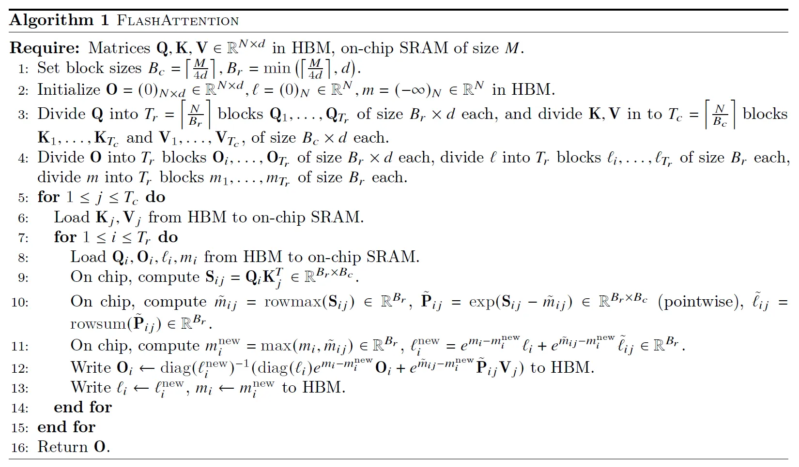

## Falash Attention的标准计算过程
输入 $Q$ , $K$ , $V$ ，形状均为 $(N, D)$ ，其中 $N$ 为序列长度, $D$ 为特征维度。
1. 计算 $S = Q * K^T$ ，形状为 $(N, N)$ 。
2. 对 $S$ 进行缩放，除以 $\sqrt{D}$ 。
3. 对 $S$ 进行 softmax，得到注意力权重矩阵 $P$ ，形状为 $(N, N)$ 。
4. 计算 $P * V$ ，得到输出矩阵 $O$ ，形状为 $(N, D)$ 。
5. 返回输出矩阵 $O$ 。

## 基于Torch拼接方式的实现
原始输入 $Q$, $K$, $V$ 存储在HBM上。
1. 从HBM加载Q, K到SRAM；
2. 计算 $S = Q * K^T$ ，对 $S$ 进行缩放，除以 $\sqrt{D}$ ，保存在SRAM上；
3. 将 $S$ 写到HBM上；
4. 从HBM加载 $S$ 到SRAM；
5. 计算 $P = softmax(S)$ ，保存在SRAM上；
6. 将 $P$ 写到HBM上；
7. 从HBM加载 $P$ $V$ 到SRAM；
8. 计算 $O = P * V$ ，保存在SRAM上；
9. 将 $O$ 写到HBM上；
10. 返回输出矩阵 $O$ 。

其中，中间结果 $S$ $P$ 反向传播时需要用到，需要保存在HBM上。  
可以看出：随着序列长度 $N$ 的增加，需要缓存 $N^2$ 的数据量，SRAM的容量会成为瓶颈。

# Flash Attention

目标：减少Attention Matrix从HBM的读写操作，减低IO开销。    

1.通过分块计算，融合多个运算，减少中间计算结果缓存；    
2.反向传播时，重新计算中间计算结果，来解决不缓存中间结果带来的梯度传播计算问题。   

=> 将原来SRAM缓存容量随序列长的平方增长的问题，降低到线性增长。

## Softmax的分块计算

### 原始Softmax计算

对于第 $i$ 行的元素 $S_{i,j}$ ，其Softmax值为： $m_i = max(S_{i,1},...,S_{i,N})$ 

$$
P_{i,j} = \frac{e^{S_{i,j} - m_i}}{\sum_{k=1}^{N}e^{S_{i,k} - m_i}}
$$

### 分块Softmax计算

$x = (x_1,...,x_N,...,x_{2N})$

$x^1 = (x_1,...,x_N)$  

$m^1 = max(x_1,...,x_N)$  

$p(x^1) = [e^{x_1 - m^1}, e^{x_2 - m^1}, ..., e^{x_N - m^1}]$   

$l(x^1)=\sum_{i=1}^{N}p(x^1)_i$    

$x^2 = (x_{N+1},...,x_{2N})$   

$m^2 = max(x_{N+1},...,x_{2N})$   

$p(x^2) = [e^{x_{N+1} - m^2}, e^{x_{N+2} - m^2}, ..., e^{x_{2N} - m^2}]$

$l(x^2)=\sum_{i=1}^{N}p(x^2)_i$  

$m(x)=max(m^1, m^2)$  

$p(x)=[e^{m^1 - m(x)}p(x^1), e^{m^2 - m(x)}p(x^2)]$  

$l(x)=e^{m^1 - m(x)}l(x^1) + e^{m^2 - m(x)}l(x^2)$   

$softmax(x)=\frac{p(x)}{l(x)}$  

## Flash Attention的计算过程

# 参考

https://www.bilibili.com/video/BV1UT421k7rA/?vd_source=217d4d5dfabbb44dda7e375e825465a3